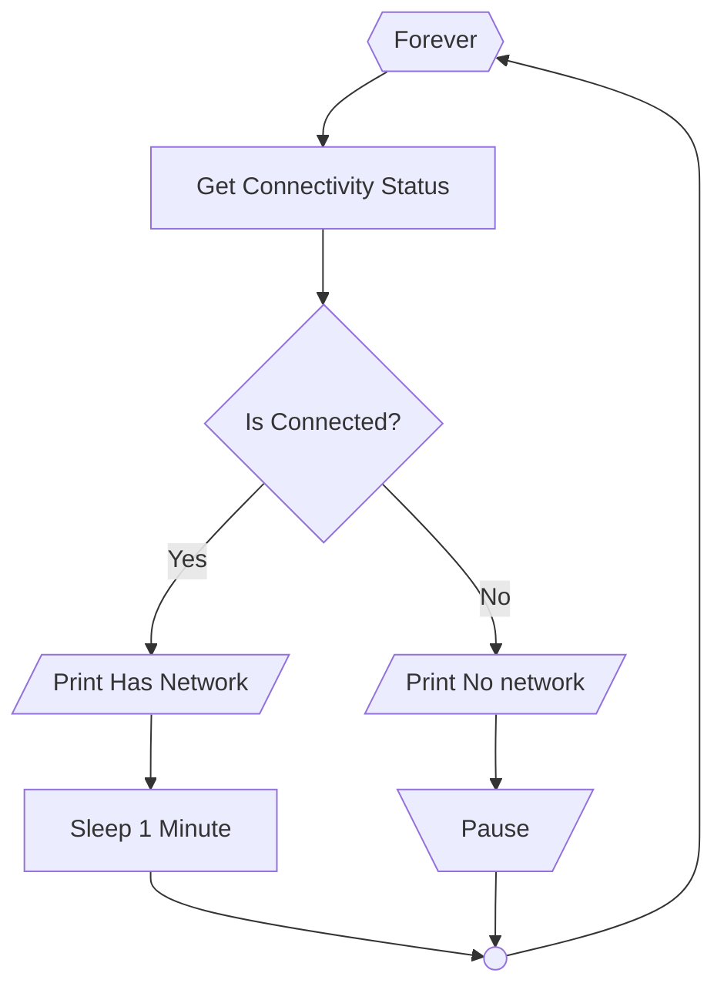

# warn-no-network-windows
Warn when there's no network connection in Windows



## How to install the dependencies of the program
In Powershell, run following command to install the dependency BurntToast:
```powershell
Install-Module -Name BurntToast -Force -Scope CurrentUser
```

## How to run the program
Run the program in WSL:
```bash
./warn-no-network.sh
```

## How to use
When there's no network connection, a Windows notification and a xmessage window will pop up
After network is resumes, click the X on popped up xmessage window to continue the program

## Example usage
When using iPhone as personal hotspot, the network connection may be unstable. This program detects no network connection and warns the user, the user can fix the iPhone personal hotspot immediately when connection issue happens.

## Program design
Windows notification ensures that the notification will appears on top of other windows
xmessage stop the program when no network connection happens to prevent keep triggering Windows notifications.
